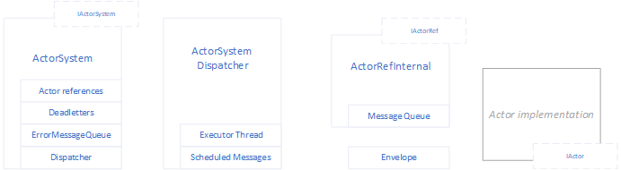

# Lightweight Actor System #
The purpose is to provide the lightweight in-process asynchronous message based communication between the components (Inspired by [Akka.net](http://getakka.net) which provides actor system implementation for the applications where more robust solution is needed).

**NuGet package ID:** net.adamec.lib.common.actor

Actor is a generally any component implementing `IActor` interface registered within the Actor System that is able to receive and process the messages sent from another Actor or even from outside world. The message processing is by design asynchronous where the messages for individual actors are processed in FIFO sequence, but the Actor System also provides the support for synchronous (Request-Reply) pattern. 

### Build ###
The library uses the customized MS Build process in projects `build` and `build.tasks`. It's safe to remove such projects from solution if needed.
Details about the build process are described in [build documentation](build/readme.md).

### Code Documentation ###
The [code documentation](https://github.com/adamecr/Common.Actor/blob/master/doc/net.adamec.lib.common.actor.md) is generated during the customized build using [MarkupDoc](https://github.com/adamecr/MarkupDoc).


## Content ##
 - [High Level Architecture](#high-level-architecture)     
 - [Key Interfaces](#key-interfaces)     
  - [IActorSystem](#iactorsystem)    
    - [ActorSystemOptions](#actorsystemoptions)    
    - [Message Logging](#message-logging)    
    - [Scheduled Messages](#scheduled-messages)    
    - [Request-Reply Messaging](#request-reply-messaging)    
  - [IActor](#iactor)    
  - [IActorRef](#iactorref)    
 - [Base Actor](#base-actor)      
 - [Exchanges](#exchanges)      
  - [ExchangeActor](#exchangeactor)               
    - [Subscriptions](#subscriptions)       
    - [Message Distribution](#message-distribution)     
  - [SingleExchangeActor](#singleexchangeactor)        
  - [TypedSingleExchangeActor](#typedsingleexchangeactor)
  - [TypedMultiExchangeActor](#typedmultiexchangeactor)      
  - [RoutingKeyExchangeActor](#routingkeyexchangeactor)      
 - [Tests](#tests)     

## High Level Architecture ##  



`Actor` is any object implementing `IActor` interface publishing the method for processing the inbound messages. `ActorSystem` is the main component taking care about the actors and distributing the messages. It's usually a singleton, but its possible to have multiple actor systems if needed.
Each actor must register to `ActorSystem` first to get recognized by system (and deregister at the end of its life cycle). Actor System creates the internal reference to actor (`ActorRefInternal`) and returns the `IActorRef` interface used as a reference to `Actor` within the Actor System. `ActorRefInternal`object contains the reference to actor (`IActor`) and encapsulates the `MessageQueue` of actor. Anybody who has the reference to actor (`IActorRef`) can send the message to actor using the method `IActorRef.Tell`. The internal implementation encapsulates the message into the `Envelope` and push it to the message queue related to the actor.

Actor system manages the `ActorSystemDispatcher` running the executor thread responsible for checking the actors' message queues, pick the messages and deliver them to actors for processing. 
Dispatcher periodically loops through the queues. If there is any message, the dispatcher uses the `ThreadPool` to queue work item - process the messages for actor, so the messages for different actors can be processed in parallel in several threads. Whenever the actor is scheduled for processing, it's locked for further processing, until the scheduled processing task is finished. 
The processing of actor messages is quite simple - message is picked from queue and sent to actor for processing (invoking the `Receive` delegate returned by `IActor.ReceiveTarget`). It waits until the message is processed, picks another message and send it to actor for processing. This ensures that the messages are processed sequentially in the order as they are enqueued (the message queue is FIFO). The system parameter max messages defines the size of single "batch" of messages to be processed before the actor is unlocked and waits for next "tick" of dispatcher.
Actor System maintains two system queues:
- `Deadletters` is the queue containing the messages that are not handled by actor or undeliverable. Whenever the message is sent to an actor for processing, the actor has to return `true` if the message was processed or `false` in case it didn't process (handle) the message. The unhandled messages are moved to dead letters queue then.
- `ErrorMessageQueue` contains the messages that caused an exception while being processed by an actor. The exception is catched by dispatcher (exactly by scheduled work task distributing the messages to particular actor), encapsulated together with the message causing the exception into `ErrorMessage` (inherits from `Envelope`) and enqueued to the error message queue. 
 
## Key Interfaces ## 
### IActorSystem ###
The Actor System published interface. Provides access to options and system queues, supports the actor (de)registration, dispatcher management (start/stop) as well as message scheduling and synchronous (Request-Reply) messaging. 
```csharp
public interface IActorSystem
{
   ActorSystemOptions Options { get; }

   IMessageQueue DeadLetters { get; }
   IMessageQueue ErrorMessageQueue { get; }

   IActorRef RegisterActor(IActor actor, string name);
   void DeRegisterActor(IActorRef actorRef);
   
   void Start();
   void Stop();

   string ScheduleMessage(IActorRef sender, IActorRef recipient, TimeSpan period, object message);
   string ScheduleMessage(IActorRef sender, IActorRef recipient, DateTime nextFire, object message);
   bool CancelScheduledMessage(string id);
   bool CancelScheduledMessages(IActorRef recipient, Type messageType);

   T Ask<T>(IActorRef recipient, object message, int timeoutMilliseconds, bool throwTimeoutException = false);
   object Ask(IActorRef recipient, object message, Type responseType, int timeoutMilliseconds, bool throwTimeoutException = false);
}
```

- `Options` - Returns the reference to current `ActorSystemOptions`
- `DeadLetters` - Provides the access to dead letters queue
- `ErrorMessageQueue` - Provides the access to error messages queue
- `RegisterActor` - Registers the actor to Actor System. Name of the actor should be unique, but this is not checked. Each actor must register first to be able to receive the messages within the actor system.
- `DeRegisterActor` - De-register actor identified by actor reference. from the Actor System. If `actorRef` is not found within the Actor System, `WARN` message is logged, but raises no error/exception.
- `Start` - Starts the message dispatcher (started by default within `ActorSystem` constructor)
- `Stop` - Stops the message dispatcher (can be restarted using `Start` method)
- `ScheduleMessage`, `CancelScheduledMessage` - Provides the support for scheduled messages (see below)
- `Ask` - Provides the support for synchronous (Request-Reply) messaging pattern (see below)

#### ActorSystemOptions ####
`ActorSystemOptions` is the class providing the actor systems with configuration. The options are parameter of `ActorSystem` constructor (so can be injected using DI) and are stored as reference to `ActorSystemOptions` instance, so the properties can be changed in runtime if needed.
```csharp
public class ActorSystemOptions
{
   public static ActorSystemOptions Default { get; }

   public bool LogEnqueuedMessages { get; set; } = false;
   public bool LogDispatchMessages { get; set; } = false;
   public bool LogNotHandledMessages { get; set; } = false;

   public int MaxDispatchMessagesInBatch { get; set; } = 10;

   static ActorSystemOptions()
   {
      Default = new ActorSystemOptions();
   }
}
```
`MaxDispatchMessagesInBatch` defines the maximum number of messages send for processing to single actor during one cycle of `ActorDispatcher` executor.

##### Message Logging #####
Three options properties allow/disable the message logging. The messages are logged into logger with syntax `<class name>.[MESSAGE]`, so it's possible to configure the message logging targets different than the ones for application logging.
- `LogEnqueuedMessages` if enabled, logs each enqueued message with `DEBUG` level
- `LogDispatchMessages` if enabled, logs each message before dispatched to actor with `DEBUG` level
- `LogNotHandledMessages` if enabled, logs each not handled message with `WARN` level
- Besides that, all messages causing the exception while processing by actor are logged with `ERROR` level

#### Scheduled Messages ####
Actor System supports scheduling of two types:
- One-time (non-periodical) messages are scheduled for given date and time. The dispatcher enqueues the message to recipient's queue next executor run after the defined date and time. 
- Periodical messages are scheduled for given period. The dispatcher enqueues the message to recipient's queue next executor run after each period. Technically just the next message is scheduled for corresponding date and time and when it's equeued, another "instance" of scheduled message is created for the next period.

As describe above, you can't rely on the exact processing time of the scheduled messages, because the schedule tells when the message will be put into the queue (as the last message), so if there are any other messages pending in the queue, it will delay the message processing. Also the time when the messages are enqueued is not 100% exact - the dispatcher executor checks in each run (loop) for the scheduled messages with the next required fire time equal or older than current time so there is also small cost related to the dispatch of the messages.

The messages are scheduled using `ScheduleMessage`functions of `IActorSystem` interface
```csharp
string ScheduleMessage(IActorRef sender, IActorRef recipient, TimeSpan period, object message);
string ScheduleMessage(IActorRef sender, IActorRef recipient, DateTime nextFire, object message);
```
Both functions return the unique ID of scheduled message, so it can be canceled later on if needed (mainly used for periodic messages, but it's also possible to cancel the one-time scheduled message before it's fired).

```csharp
bool CancelScheduledMessage(string id);
```
Actor System also supports the second way of canceling the messages - cancel all messages of given type for defined recipient. 
```csharp
bool CancelScheduledMessages(IActorRef recipient, Type messageType);
```
#### Request-Reply Messaging ####
Astor System support Request-Reply messaging pattern using `IActorSystem.Ask` methods. The temporary internal actor is created and the requested message is sent from this temporary actor to the recipient. When the recipient replies, the temporary actor check the type of response and if matches, it's "returned" back to the `Ask` method and the temporary actor is dismissed.
In case that the required response doesn't come in given time period (timeout) the `Ask`method returns `default(T)` or throws `TimeoutException` depending on given parameter.
So even if the message processing is "internally" asynchronous, the `Ask` method is blocked (synchronous) and waits for the proper response or timeout.
  
```csharp
T Ask<T>(IActorRef recipient, object message, int timeoutMilliseconds, bool throwTimeoutException = false);
object Ask(IActorRef recipient, object message, Type responseType, int timeoutMilliseconds, bool throwTimeoutException = false);
```

### IActor ###
Each actor must implement `IActor` interface allowing the dispatch of the messages for processing. The dispatcher checks whether the actor accepts the messages for processing (`CanReceive`) and if `true`, the messages are dispatched to `ReceiveTarget`. This allows the actor to temporarily pause the message delivery if needed by setting `CanReceive` to `false`. In such case, the messages are still enqueued to actor's mailbox, but are not dispatched to actor until `CanReceive` is set to `true`.
Actor can have multiple methods for processing the messages (for example base on the internal state of the actor). Such methods must have the same signature are defined in `Receive` delegate. `ReceiveTarget` property points to current method used for message processing

```csharp
public delegate bool Receive(Envelope envelope);

public interface IActor
{
   bool CanReceive { get; }
   Receive ReceiveTarget { get; }
}
```
### IActorRef ###
`IActorRef` is the interface used for communication with the actors. It's a reference to an actor created by Actor System during the actor registration.
The interface publishes the `Name` of the actor and the method `Tell` used to send a message to the actor.
```csharp
public interface IActorRef
{
   string Name { get; }
   void Tell(object message, IActorRef sender, string routingKey = null);
}
```

## Base Actor ##
`Actor` class is reference implementation of `IActor`that can be simply inherited in own actors. It provides the automatic registration in constructor and de-registration while disposing. The actor reference is published via `Self` property.

Reference implementation encapsulates the actor behavior feature where actor can have multiple message handlers implementing the `Receive`delegate. The behavior of the actor can be simply switched using the `Become` method, so the messages will be dispatched to selected handler. It's possible just to use the default behavior by overriding the `Receive` method, of course additional behaviors/handlers are still available. The handler can be not only the method, but the lambda can be used as well (as for example in `DropAllReceive` handler).

Method `Unhandled` provides an option to customize pro processing of unhandled messages if needed (for example as a "message bin"), but keep in mind, it needs to be called explicitly in the message handler.

```csharp
public abstract class Actor : BaseDisposable, IActor
{
    protected ActorSystem ActorSystem { get; }
    public IActorRef Self { get; }
    public Receive ReceiveTarget { get; protected set; }
    
    protected Actor(ActorSystem actorSystem, string name)
    {
    	ActorSystem = actorSystem;
    	ReceiveTarget = Receive;
    	Self = actorSystem.RegisterActor(this, name);
    }
    
    protected override void DisposeManaged()
    {
    	base.DisposeManaged();
    	ActorSystem.DeRegisterActor(Self);
    }
    
    protected Receive DropAllReceive { get; } = (e) => false;
    protected virtual void Become(Receive handler)
    {
    	ReceiveTarget = handler ?? DropAllReceive;
    }
    
    protected virtual void BecomeDefault()
    {
    	ReceiveTarget = Receive;
    }
    
    protected virtual bool Receive(Envelope envelope)
    {
    	return Unhandled(envelope);
    }
    
    protected virtual bool Unhandled(Envelope envelope)
    {
    	return false;
    }
}
```
## Exchanges ##
Exchanges are the actors that route (forward) the messages to another actors based on the subscriptions. There might be virtually any rules how to manage the subscriptions as well as how to match the messages to subscriptions. The abstract class `ExchangeActor` helps to implement the exchanges using some common logic.

### ExchangeActor ###
`ExchangeActor` is the base class for the exchanges. It provides the common logic for the exchanges implementations. To implement own exchange actor, simply inherit from generic `ExchangeActor`, providing the types for subscribtions and subscription/unsubscription messages and adjust the logic where needed. 
```csharp
public abstract class ExchangeActor<TSubscription,TSubscriptionMessage,TUnSubscriptionMessage> : Actor
    where TSubscription:Subscription
    where TSubscriptionMessage : SubscriptionMessage 
    where TUnSubscriptionMessage : UnSubscriptionMessage
```

`ExchangeActor` encapsulates the `CanReceive` property into `Start` and `Stop` methods, allowing to pause (stop) and resume (start) the exchage if needed (as described above, the messages are not delivered to stopped actor, but are pending within the queue).
```csharp
public virtual void Start() { CanReceive = true;  }
public virtual void Stop()  { CanReceive = false; }
```
#### Subscriptions ####
The `ExchangeActor` stores the list of subscriptions internally and use it to manage the subscriptions and to match the messages
```csharp 
protected List<TSubscription> Subscriptions { get; } = new List<TSubscription>();
``` 
The base `Subscription` just encapsulates the reference to subscribing actor, but it can be extended as needed to contain all information needed for subscription management and message matching.The subscriptions are managed internally by exchange actor, actors use the subscription/unsubscription messages to subscribe/unsubscribe. The base messages have no attributes, but can be extended for more complex subscriptions (see below).
```csharp 
public class Subscription
{
    public IActorRef ActorRef { get; }
    public Subscription(IActorRef actorRef) {ActorRef = actorRef ?? throw new ArgumentNullException(nameof(actorRef));}
}

public class SubscriptionMessage{}
public class UnSubscriptionMessage{}
``` 
`ExchangeActor` has the message handler that checks for the subscription/unsubscription messages before any other message processing to manage the subscriptions. 
```csharp 
protected override bool Receive(Envelope envelope)
{
    var msg = envelope.Message;
    switch (msg)
    {
        case TSubscriptionMessage subscriptionMessage:
            Subscribe(envelope.Sender, subscriptionMessage);
            return true;

        case TUnSubscriptionMessage unSubscriptionMessage:
            UnSubscribe(envelope.Sender, unSubscriptionMessage);
            return true;
    }
    ...
}
```

The subscription logic is implemented within the `Subscribe` method. 
It first checks, whether the new subscription replaces any existing subscription by calling `ReplaceOnSubscribe` function (no subscriptions are replaced in the default implementation). If the returned list is not empty, the replaced subscriptions are removed from the list of subscriptions.

> Note: The new subscription can replace the existing subscriptions of other actors. However actor can unsubscribe only own subscriptions. Keep in mind, there is no "signaling" to the actors, that their subscription has been replaced (canceled).

At the second, the `SubscriptionFactory` is called to create the new instance of subscription and the subscription is added to the list. `SubscriptionFactory` is the place, where the extended attributes of subscriptions message are transformed into the extended attributes of subscription when needed.
```csharp 
protected virtual void Subscribe(IActorRef actorRef, TSubscriptionMessage subscriptionMessage)
{
    var subscriptionsToReplace = ReplaceOnSubscribe(actorRef, subscriptionMessage);
    if (subscriptionsToReplace != null && subscriptionsToReplace.Length > 0)
    {
        foreach (var subscription in subscriptionsToReplace)
        {
            Subscriptions.Remove(subscription);
        }
    }
    Subscriptions.Add(SubscriptionFactory(actorRef,subscriptionMessage));
}

protected virtual TSubscription[] ReplaceOnSubscribe(IActorRef actorRef,TSubscriptionMessage subscriptionMessage)
{
    return null;
}

protected abstract TSubscription SubscriptionFactory(IActorRef actorRef,TSubscriptionMessage subscriptionMessage);
```

The unsubscription logic is quite similar and is implemented within `UnSubscribe` method.
It goes through all subscriptions of unsubscribing actor and checks whether the unsubscription message is to be applied for the individual subscription using the method `IsUnSubscribeMatch`. All matching subscriptions for unsubscribing actor are removed from the list of subscriptions. The default implementation unsubscibes all actor's subscriptions.
```csharp 
protected virtual void UnSubscribe(IActorRef actorRef, TUnSubscriptionMessage unSubscriptionMessage)
{
    var subscriptions = Subscriptions.Where(s => s.ActorRef == actorRef && IsUnSubscribeMatch(s,unSubscriptionMessage)).ToArray();
    foreach (var subscription in subscriptions)
    {
        Subscriptions.Remove(subscription);
    }
}

protected virtual bool IsUnSubscribeMatch(TSubscription subscription,TUnSubscriptionMessage unSubscriptionMessage)
{
    return true;
}

```
#### Message Distribution ####
The second part of `ExchangeActor`'s message handler (`Receive` function) calls the `GetSubscriptionsForMessage` to try to match the message with subscriptions and get the applicable ones. In case no subscriptions matched, the message is dropped as unhandled. The default implementation matches any message to all subscriptions.
It's possible to modify the message or the way, how the message is distributed to subscriber by overriding the `DistributeMessage` method. The default implementation simply forwards the message to the subscriber.

```csharp 
protected override bool Receive(Envelope envelope)
{
    ...
    var subscriptions = GetSubscriptionsForMessage(envelope);
    if (subscriptions == null) return base.Receive(envelope);

    foreach (var subscription in subscriptions)
    {
        DistributeMessage(envelope,subscription);
    }

    return subscriptions.Length > 0 || base.Receive(envelope);
}

protected virtual TSubscription[] GetSubscriptionsForMessage(Envelope envelope)
{
    return Subscriptions.ToArray();
}

protected virtual void DistributeMessage(Envelope envelope, TSubscription subscription)
{
    envelope.ForwardTo(subscription.ActorRef);
}
```

### SingleExchangeActor ###
`SingleExchangeActor` is a exchange having zero or one subscriber. Any subscription replaces the previous one, no special rules neither for unsubscription nor the message distribution.
```csharp
public class SingleExchangeActor : ExchangeActor<Subscription, SubscriptionMessage, UnSubscriptionMessage>
{
    public SingleExchangeActor(IActorSystem actorSystem, string name) : base(actorSystem, name) { }

    protected override Subscription SubscriptionFactory(IActorRef actorRef, SubscriptionMessage subscriptionMessage)
    {
        return new Subscription(actorRef);
    }

    protected override Subscription[] ReplaceOnSubscribe(IActorRef actorRef, SubscriptionMessage subscriptionMessage)
    {
        return Subscriptions.ToArray();
    }
}
```

### TypedSingleExchangeActor ###
`TypedSingleExchangeActor` is a exchange supporting type based subscriptions
```csharp
public class TypedSubscription: Subscription
{
    public Type MessageType { get; }
    public TypedSubscription(Type messageType, IActorRef actorRef):base(actorRef)
    {
        MessageType = messageType ?? throw new ArgumentNullException(nameof(messageType));
    }
}

public class TypedSubscriptionMessage:SubscriptionMessage
{
    public Type MessageType { get; }
    public TypedSubscriptionMessage(Type messageType)
    {
        MessageType = messageType  ?? throw new ArgumentNullException(nameof(messageType));;
    }
}

public class TypedUnSubscriptionMessage:UnSubscriptionMessage
{
    public Type MessageType { get; }
    public TypedUnSubscriptionMessage(Type messageType)
    {
        MessageType = messageType  ?? throw new ArgumentNullException(nameof(messageType));;
    }
}
```
`TypedSingleExchangeActor` routes the messages based on the message type. There can be zero or single subscribtion per message type (the subscription replacement is on the exact match). 
While matching the messages to subscriptions, the exact type match is checked first. If not found, the exchange tries to get the first subscription, where the message type is assignable (is child) of the type defined in subscription. So for example subscription with `object` as the message type can be used as a fallback for all messages, however, it needs to be registered as last, otherwise it will "override" other subscriptions.  
```csharp
public class TypedSingleExchangeActor : ExchangeActor<TypedSubscription, TypedSubscriptionMessage, TypedUnSubscriptionMessage>
{
    public TypedSingleExchangeActor(IActorSystem actorSystem, string name) : base(actorSystem, name) { }

    protected override TypedSubscription SubscriptionFactory(IActorRef actorRef, TypedSubscriptionMessage subscriptionMessage)
    {
        return new TypedSubscription(subscriptionMessage.MessageType, actorRef);
    }

    protected override TypedSubscription[] ReplaceOnSubscribe(IActorRef actorRef, TypedSubscriptionMessage subscriptionMessage)
    {
        return Subscriptions.Where(s => subscriptionMessage.MessageType == s.MessageType).ToArray();
    }

    protected override bool IsUnSubscribeMatch(TypedSubscription subscription, TypedUnSubscriptionMessage unSubscriptionMessage)
    {
        return subscription.MessageType == unSubscriptionMessage.MessageType;
    }

    protected override TypedSubscription[] GetSubscriptionsForMessage(Envelope envelope)
    {
        var exactMatch = Subscriptions.FirstOrDefault(s => s.MessageType == envelope.Message.GetType());
        if (exactMatch != null) return new[] { exactMatch };

        var parentMatch = Subscriptions.FirstOrDefault(s => s.MessageType.IsInstanceOfType(envelope.Message));
        return parentMatch != null ? new[] { parentMatch } : null;
    }
}
```

### TypedMultiExchangeActor ###
`TypedMultiExchangeActor` is another exchange supporting type based subscriptions. In this case, there can be zero, one or multiple subscriptions per message type (the subscription replacement is on the exact match of actor reference and type). 
While matching the messages to subscriptions, the exchange tries to get the all subscriptions, where the message type is assignable (is same or child) of the type defined in subscription.  
```csharp
public class TypedMultiExchangeActor : ExchangeActor<TypedSubscription, TypedSubscriptionMessage, TypedUnSubscriptionMessage>
{
    public TypedMultiExchangeActor(IActorSystem actorSystem, string name) : base(actorSystem, name) { }
 
    protected override TypedSubscription SubscriptionFactory(IActorRef actorRef, TypedSubscriptionMessage subscriptionMessage)
    {
        return new TypedSubscription(subscriptionMessage.MessageType, actorRef);
    }

    protected override TypedSubscription[] ReplaceOnSubscribe(IActorRef actorRef, TypedSubscriptionMessage subscriptionMessage)
    {
        return Subscriptions.Where(s => actorRef == s.ActorRef && subscriptionMessage.MessageType == s.MessageType).ToArray();
    }

    protected override bool IsUnSubscribeMatch(TypedSubscription subscription, TypedUnSubscriptionMessage unSubscriptionMessage)
    {
        return subscription.MessageType == unSubscriptionMessage.MessageType;
    }

    protected override TypedSubscription[] GetSubscriptionsForMessage(Envelope envelope)
    {
        return Subscriptions.Where(s => s.MessageType.IsInstanceOfType(envelope.Message)).ToArray();
    }
}
```
### RoutingKeyExchangeActor ###
`RoutingKeyExchangeActor` is exchange supporting type based subscriptions with additional filtering using the routing key associated to the message (envelope). The subscription is defined as triple actor reference, message type and the routing key (even if null). 
While matching the messages to subscriptions, the exchange tries to get the all subscriptions, where the message type is assignable (is same or child) of the type defined in subscription and the routing keys match. When the subscription's routing key is null, it allows all values of routing key associated to message. However, when the message's routing key is null, it's matched only to the subscriptions with null routing key.  
```csharp
public class RoutingKeyExchangeActor : ExchangeActor<RoutingKeySubscription, RoutingKeySubscriptionMessage, RoutingKeyUnSubscriptionMessage>
{
    public RoutingKeyExchangeActor(IActorSystem actorSystem, string name) : base(actorSystem, name) { }

    protected override RoutingKeySubscription SubscriptionFactory(IActorRef actorRef, RoutingKeySubscriptionMessage subscriptionMessage)
    {
        return new RoutingKeySubscription(subscriptionMessage.MessageType, subscriptionMessage.RoutingKey, actorRef);
    }

    protected override RoutingKeySubscription[] ReplaceOnSubscribe(IActorRef actorRef, RoutingKeySubscriptionMessage subscriptionMessage)
    {
        return Subscriptions.Where(s => actorRef == s.ActorRef &&
                                        subscriptionMessage.MessageType == s.MessageType &&
                                        subscriptionMessage.RoutingKey == s.RoutingKey).ToArray();
    }

    protected override bool IsUnSubscribeMatch(RoutingKeySubscription subscription, RoutingKeyUnSubscriptionMessage unSubscriptionMessage)
    {
        return subscription.MessageType == unSubscriptionMessage.MessageType &&
               subscription.RoutingKey == unSubscriptionMessage.RoutingKey;
    }

    protected override RoutingKeySubscription[] GetSubscriptionsForMessage(Envelope envelope)
    {
        return Subscriptions.Where(s =>
            s.MessageType.IsInstanceOfType(envelope.Message) &&
            (s.RoutingKey == null || IsRoutingKeyMatch(s.RoutingKey, envelope.RoutingKey))).ToArray();
    }

    protected virtual bool IsRoutingKeyMatch(string subscriptionRoutingKey, string messageRoutingKey)
    {
        return subscriptionRoutingKey == messageRoutingKey;
    }
}
```

## Tests ##
Tests are implemented using [xUnit](https://xunit.github.io/). As the message delivery is asynchronous and utilize several threads/thread pool, it's bit tricky for unit testing. The tests are checked for the functionality, so in case of problems (failed tests), it's recommended to check the output and adjust the delays/timeouts if needed.

Note: adjust the `LogHome` variable in `nlog.config` of test project as you need.